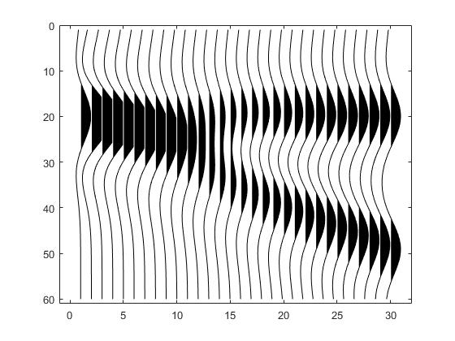

# High resolution easy tutorial

> 这是一份关于反射系数快速入门的`ＭＡＴＬＡＢ`代码教程

## 1 构建二维反射系数模型　

```matlab
ref = zeros(N,trace);
ref(20,:)=0.3;				%楔形顶
for j=1:trace
	ref(20+round((j-1)*1),j)=0.3; %楔形底
end
```


## 2 构建子波矩阵
### 雷克子波
```matlab
dt=0.001;
fm=30;   trun_time=0.04;  t=-trun_time:dt:trun_time;
w=(1-2*(pi*fm*t).^2).*exp(-(pi*fm*t).^2);
```


### 子波矩阵
```matlab
nWaveSampPoint=length(w);
W_temp=convmtx(w',length(ref(:,1)));
WW=W_temp(((nWaveSampPoint-1)/2)+1:end-((nWaveSampPoint-1)/2),:);    
```


## 3 反射系数与子波矩阵褶积

```matlab
seis=WW*ref;
```



```matlab
seis=pnoise(seis,0.01);   %%加噪
```


## 4 用求解器求解

```matlab
r_inv = zeros(size(ref));
for i = 1 : size(seis,2)
    [r_inv(:,i)] = SolverFunc(seis(:,i),WW,mu1,mu2,D,maxiter,p,tol);
end
```


